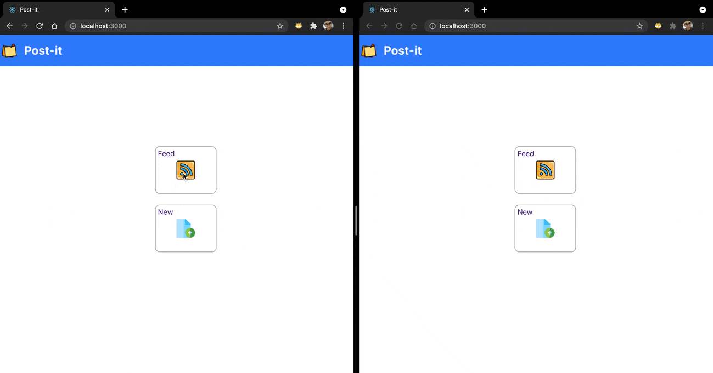

# Post-it

Post-it React app with Server Sent Events (SSE) notifications.

## System overview



## Available Scripts

In the project directory, you can run:

```
yarn start
yarn test
yarn build
```

Open [http://localhost:3000](http://localhost:3000) to view it in the browser.